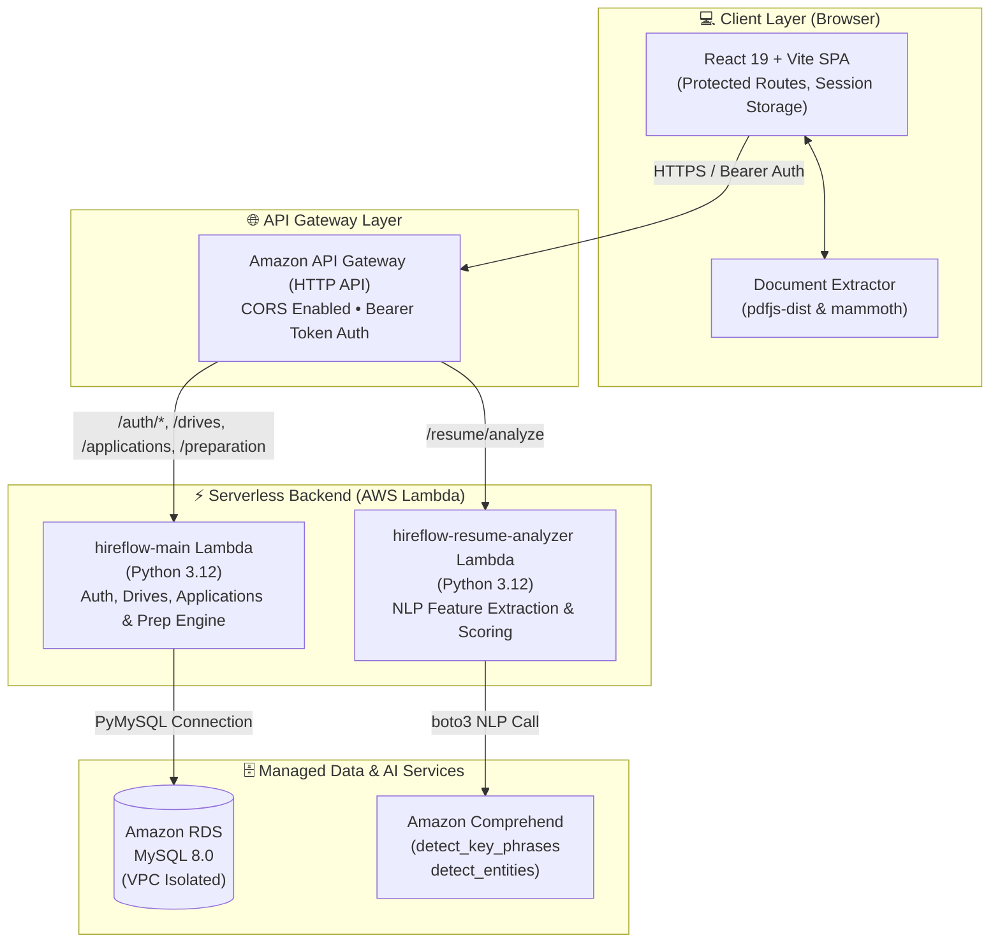
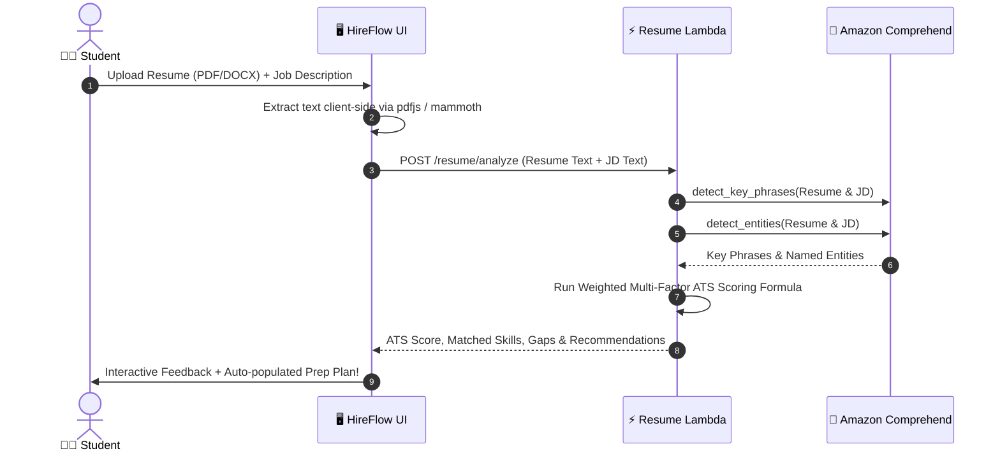

# <p align="center">🚀 HireFlow AI</p>

<p align="center">
  <strong>Intelligent Campus Placement Management & Adaptive AI Preparation Platform</strong>
</p>

<p align="center">
  <a href="https://react.dev/"></a>
  <a href="https://vitejs.dev/"></a>
  <a href="https://www.python.org/"></a>
  <a href="https://aws.amazon.com/lambda/"></a>
  <a href="https://aws.amazon.com/comprehend/"></a>
  <a href="https://aws.amazon.com/rds/"></a>
</p>

<p align="center">
  <a href="#-why-hireflow-ai">Why HireFlow AI</a> •
  <a href="#-core-features">Core Features</a> •
  <a href="#-system-architecture">Architecture</a> •
  <a href="#-how-the-ai-engine-works">AI & ATS Engine</a> •
  <a href="#-quick-start">Quick Start</a> •
  <a href="#-project-roadmap">Roadmap</a>
</p>

---

## 💡 Why HireFlow AI?

Campus placement drives are fast-paced and overwhelming. Engineering students are often forced to juggle fragmented spreadsheets, blind resume submissions, and generic preparation with zero visibility into why they get screened out.

| ❌ The Old Way (Manual & Fragmented) | ✅ The HireFlow AI Way |
|:-------------------------------------|:-----------------------|
| 📁 Disorganized drive tracking across email & WhatsApp | 🎯 **Centralized Drive Hub** with real-time deadline filters & 1-click apply |
| ❓ Blind applications with unknown ATS match score | 🤖 **Comprehend NLP Resume Screening** with instant gap analysis |
| 📚 Generic, unpersonalized interview preparation | ⚡ **Adaptive Question Engine** tailored to current stage & detected skill gaps |
| 🤷 No clarity on application stages & feedback | 📊 **Visual 6-Stage Pipeline** tracking status from application to final offer |

---

## ⚡ Core Features

<div align="center">

| 🎓 Placement Drive Hub | 📄 AI Resume Analyzer |
|:---|:---|
| • Live drive directory powered by **Amazon RDS MySQL**<br>• Filter by eligibility, stipend, role, and package (LPA)<br>• Automated duplicate application prevention<br>• Support for custom JD uploads beyond campus drives | • Client-side parsing (**PDF, DOCX, TXT**) with zero latency<br>• **Amazon Comprehend** NLP extracts key phrases & entities<br>• Instant ATS Match Score (0–100%) against target JD<br>• Categorized matched skills & critical missing skill alerts |

| 🎯 Adaptive Prep Engine | 📈 6-Stage Tracking Pipeline |
|:---|:---|
| • Context-aware question curation (50+ curated questions)<br>• Prioritizes questions addressing **your specific resume gaps**<br>• Covers Technical, Aptitude, Core CS & STAR Behavioral<br>• Works with both College Drives and Custom JDs | • Visual kanban-style progress for each company<br>• Stages: `Applied` ➔ `Screening` ➔ `Aptitude` ➔ `Technical` ➔ `HR` ➔ `Offer`<br>• Real-time updates with Bearer token authentication<br>• Clean, responsive student dashboard with actionable metrics |

</div>

---

## 🏗️ System Architecture

HireFlow AI is designed as a **modern, cloud-native serverless architecture** deployed in AWS `ap-south-1` (Mumbai).



---

## 🧠 How the AI & ATS Engine Works

The resume assessment is **not a black box**. It combines AWS NLP intelligence with a transparent, deterministic matching algorithm.



### 📊 Transparent ATS Scoring Breakdown

HireFlow AI calculates the match score using a weighted multi-factor formula:

```text
┌────────────────────────────────────────────────────────────────────────┐
│  TOTAL ATS SCORE = (0.60 × SkillMatch) + (0.25 × KeyPhrase) + (0.15 × Entity) │
└────────────────────────────────────────────────────────────────────────┘
```

| Factor | Weight | Description |
|:-------|:------:|:------------|
| **Skill Match** | `60%` | Exact and synonym match across an 80+ curated technical skill dictionary |
| **Key Phrase Relevance** | `25%` | Semantic key phrases extracted by **Amazon Comprehend** common to both docs |
| **Entity Relevance** | `15%` | Named entity overlaps (technologies, tools, organizations, credentials) |

---

## 🗄️ Database Architecture

Structured relational model running on **Amazon RDS MySQL**:

```text
┌──────────────┐       ┌─────────────────┐       ┌──────────────────┐
│   students   │ 1   * │  applications   │ *   1 │ placement_drives │
├──────────────┤───────├─────────────────┤───────├──────────────────┤
│ id (PK)      │       │ id (PK)         │       │ id (PK)          │
│ roll_number  │       │ student_id (FK) │       │ company_id (FK)  │
│ full_name    │       │ drive_id (FK)   │       │ role_title       │
│ branch, cgpa │       │ current_stage   │       │ package_lpa      │
└──────────────┘       │ status          │       │ deadline_date    │
       │               └─────────────────┘       └──────────────────┘
       │ 1                                                │ *
       │ *                                                │ 1
┌──────────────┐                                 ┌──────────────────┐
│   sessions   │                                 │    companies     │
├──────────────┤                                 ├──────────────────┤
│ token (PK)   │                                 │ id (PK)          │
│ student_id   │                                 │ name, sector     │
└──────────────┘                                 └──────────────────┘
```

---

## 🛠️ Tech Stack & Tooling

<table>
  <tr>
    <td align="center" width="25%"><strong>Frontend</strong></td>
    <td>React 19, Vite 6, React Router DOM 7, pdfjs-dist, Mammoth, Vanilla CSS Custom Design System</td>
  </tr>
  <tr>
    <td align="center" width="25%"><strong>Backend</strong></td>
    <td>Python 3.12, AWS Lambda, Amazon API Gateway, PyMySQL, PBKDF2-SHA256 Auth</td>
  </tr>
  <tr>
    <td align="center" width="25%"><strong>AWS Services</strong></td>
    <td>Amazon Comprehend (NLP), Amazon RDS (MySQL), Amazon API Gateway, AWS IAM, Amazon CloudWatch</td>
  </tr>
  <tr>
    <td align="center" width="25%"><strong>Testing & Quality</strong></td>
    <td>Automated Python REST test suites, ESLint, Postman/curl collections</td>
  </tr>
</table>

---

## 🚀 Quick Start

### 1. Clone the Repository
```bash
git clone https://github.com/sahil0078sharma-oss/hireflow-ai.git
cd hireflow-ai
```

### 2. Configure Environment
Copy the example environment configuration:
```bash
cp .env.example .env
```
Update `.env` with your API Gateway invoke URL:
```env
VITE_API_BASE_URL=https://your-api-id.execute-api.ap-south-1.amazonaws.com
```

### 3. Run Frontend Locally
```bash
npm install
npm run dev
```
Open **`http://localhost:5173`** in your browser.

<details>
<summary><strong>🔧 Backend Deployment Guide (Click to expand)</strong></summary>

<br>

#### Database Setup
Execute the SQL files in your MySQL instance (Amazon RDS or local):
```bash
mysql -h <rds-endpoint> -u <username> -p < schema.sql
mysql -h <rds-endpoint> -u <username> -p < seed.sql
```

#### Lambda Functions
1. **hireflow-main** (`backend/`):
   - Package `lambda_function.py`, `preparation_engine.py`, `question_bank.py`, and `pymysql` dependencies into a zip archive.
   - Configure environment variables: `DB_HOST`, `DB_USER`, `DB_PASSWORD`, `DB_NAME`, `DB_PORT`.
   - Attach to your VPC subnet with access to RDS.
2. **hireflow-resume-analyzer** (`backend_resume/`):
   - Upload `lambda_function.py`.
   - Attach IAM policy containing `comprehend:DetectKeyPhrases` and `comprehend:DetectEntities`.

</details>

---

## 🗺️ Project Roadmap

- [x] **Student Authentication** (PBKDF2 password hashing & session management)
- [x] **Placement Drive Directory** with search, filters, and dynamic drive creation
- [x] **Application Pipeline** tracking candidates through 6 recruitment stages
- [x] **Amazon Comprehend NLP Resume Analyzer** with key phrase & entity extraction
- [x] **Deterministic ATS Score Calculation** (60/25/15 weighted formula)
- [x] **Adaptive Placement Preparation Engine** prioritizing identified skill gaps
- [x] **Custom JD Flow** supporting off-campus job preparation
- [ ] 🔮 College / TPO Admin Dashboard for recruiter drive management
- [ ] 🔮 Amazon S3 direct upload for persistent resume storage
- [ ] 🔮 Embedding-based semantic similarity search for custom tech roles
- [ ] 🔮 Automated SMS/Email interview alerts via Amazon SNS

---

## 👨‍💻 Author

**Sahil Sharma**  
*B.Tech in Computer Science & Engineering*  
*Arya College of Engineering & IT, Jaipur*  
*Specialization: AWS Machine Learning & Cloud Architecture*  

[](https://github.com/sahil0078sharma-oss)

---

<p align="center">
  <sub>Built with ❤️ for graduating engineers aiming for their dream careers.</sub>
</p>
